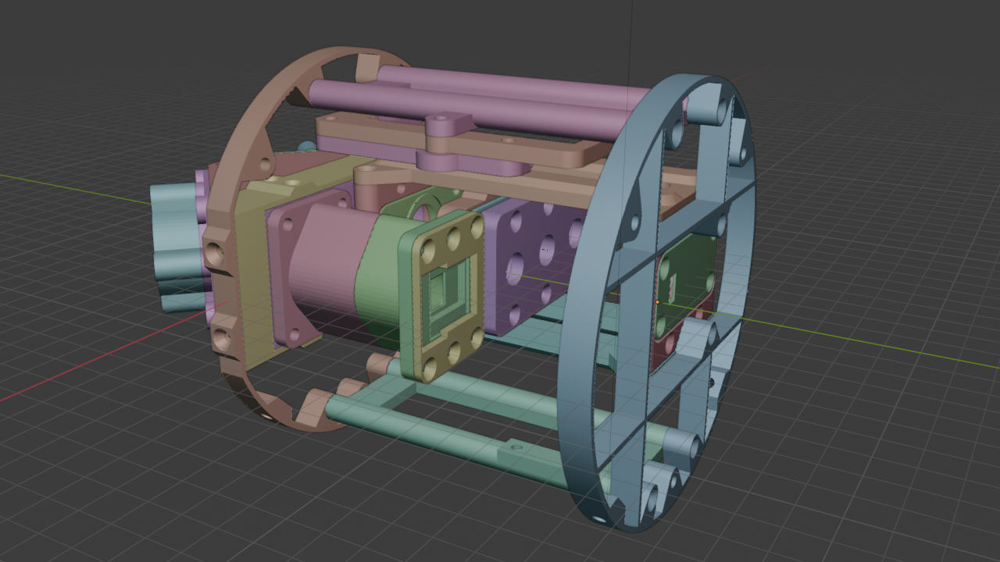
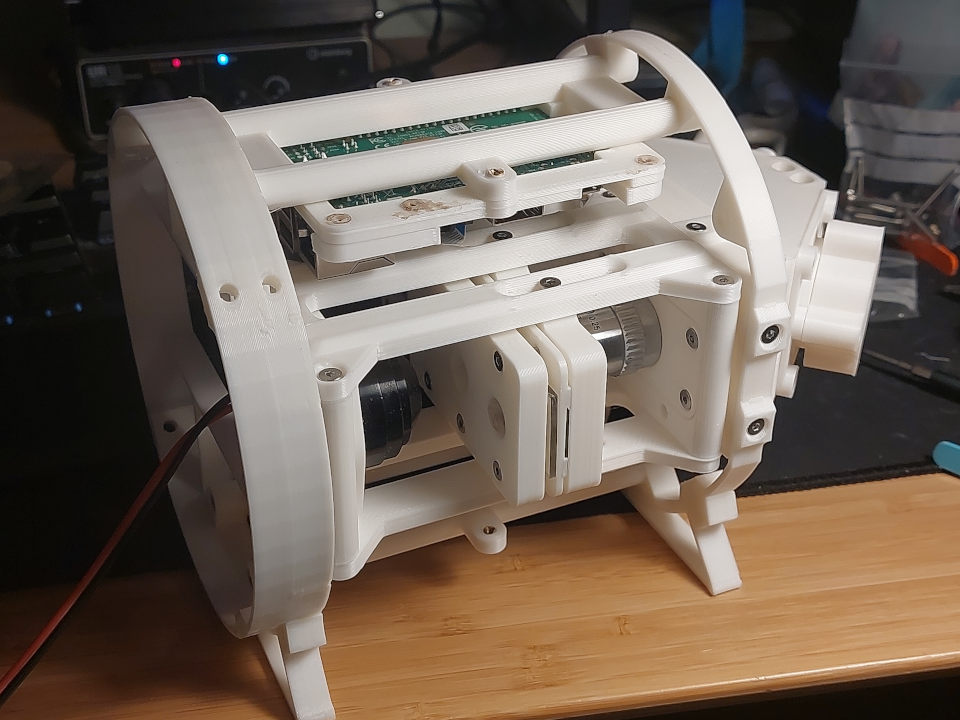

# Particle Imager for Plankton in the Environment

The PIPE is an almost fully 3D-printable pumped fluid microscope targeting particles in the range of 10-500 micron. As designed, it requires ***zero*** specialist components, with everything being either 3D-printable, readily avalaible to purchase on sites like eBay, or quickly made with a hacksaw and drill.

Early prototype of the PIPE

Side-by-side comparison of the resolution of a PIPE prototype vs the IFCB

## Licence and acknowledgements

This project would not have been possible without the work of the team at FairScope, creators of the [PlanktoScope](https://github.com/fairscope/PlanktoScope). The PIPE is heavily inspired by the PlanktoScope, and borrows some pieces of its design. All physical designs for the PIPE are therefore also CERN OHL-S V2 licensed, and you are free to adapt and re-use the designs in accordance with the licence.

## Non-printable parts required

- 2x 8mm ID, 14mm OD, 0.5mm thick washer (stainless steel preferably, although copper crush washers also work)
- ~50 M3 16mm countersunk hex bolts
- ~50 M3 4-6mm brass threaded inserts
- 2x 6x2mm o-ring
- 1x 12x2mm o-ring
- 2x 10x2mm o-ring
- 1x 38x3mm o-ring
- 4x Female Luer Lock to 2.4mm silicone tube ID fittings
- 4x Male Luer Lock to 2.4mm silicone tube ID fittings
- About 1m 2mm ID silicone tube
- Standard microscope slide (75x26x1mm)
- 2x 25mm diameter CO2 laser cutter Molybdenum mirrors
- Piece (75x26x2mm) of clear acrylic or polycarbonate with two 5mm holes drilled 50mm apart, centered
- Single segment (10-30mm) of 12v white LED strip
- Peristaltic pump with 2mm silicone tube fittings
- Standard optical microscope condenser
- Standard Plan 10/0.25 Objective with RMS thread (must NOT be infinity-corrected)
- Raspberry Pi 3 B+ (or Later) and power supply
- Raspberry Pi Camera Module 3
- 12V 2A power supply
- 2x step-down DC-DC converters 12V input 5V 2A(minimum) output

## Notes on printing

All components have been printed successfully on a stock Creality Ender 3. For most pieces, the default print settings are 0.4mm layer heights with the "SUPERDRAFT" speed preset in Prusa Slicer. The only exceptions are:

- slide/optical_stage_slide_oring_guide
- optical_stage/objective_mount

These parts in particular were printed with 0.2mm layer heights on the "NORMAL" preset.

Tolerances are built in to most designs, and will be suitable for most consumer 3D printers, but if you need to change them, look for a variable called "slop_adjust" near the top of the OpenSCAD file. This is used to set the gap between various surfaces that are meant to connect or brush past each other.

## Why is it called PIPE?

Because it fits in one! The entire design is built to fit in a 150mm ID pipe so it can be sealed within a pressure housing. While there aren't designs for a pressure housing included here, 150mm was chosen as it's also relatively easy to find [150mm ID PVC ducting](https://www.screwfix.com/p/manrose-150mm-round-ducting-1m/207gy). If you're not in need of serious depth rating, this will do the job of keeping the device dry.
